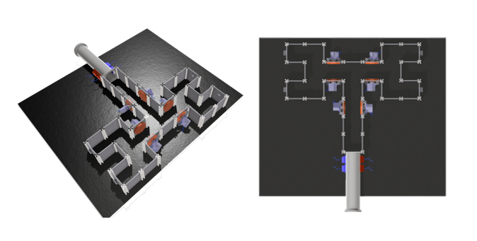

# Mice maze
#### Active exploration setup for rodents

This is a repository for building and running an experiment investigating how sensory cues affect mouse exploration in a modifiable maze.

### List of repository contents ###

#### 3dmodels
* Models used to make/3dprint parts used in the maze setup.

#### code
* Contains code used in the project.
* * Scripts used to process the video recordings of mice in the maze and a script used for the pilot deeplabcut test.
* * Arduino code to control stimuli settings and reward delivery.
* * Walkthrough to use the automatic maze.

#### construction_photos
* A selection of photos of the maze during it's development for illustrative purposes.

#### drawings
* Schematics and drawings. Such as the format of the base plate holes.

#### Contributors of the maze:
* Miguel Maravall
* Oluwaseyi Jesusanmi
* Andre Maia Chagas
* Yuri Elias Rodrigues
* Maja Nowak
* Marcus Burnell-Spector
* Shahd Al Balushi
* Isabel Maranhao
* Alejandra Carriero 
* Henry Williams 
