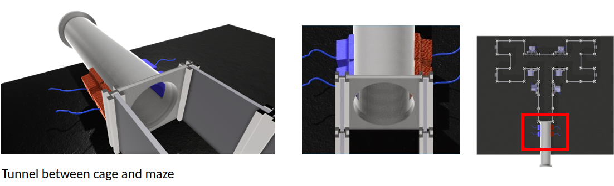

## Automatic maze code

#### Entry sensor code using Beehive+micropython - **sensor.py**
* write on the terminal (Linux) when instructed
```
ampy --port /dev/ttyUSB0 --baud 115200 run path_to/sensor.py &> sensor.csv
```



#### Grated tunable walls code - *tunable_walls.py*
* First, upload a *standard firmata* ([tutorial how to upload standard firmata](https://www.instructables.com/Arduino-Installing-Standard-Firmata/)) to an Arduino Uno, and wire it using a breadboard.
* A calibration file needs to be created to interpolate the angles measured at 0°, 45°, 90° and 135°. A calibration example sheet is given at **angle_tuning.csv**.
* Once the servos are calibrated, the angles can be defined as the function *move_servo_tuned()* at *tunable_walls.py*. Example:
* * Move servo labelled "RR" to 90 using:
* * ```
 move_servo_tuned(90,"RR")
```


#### Food delivery - *food_delivery.py*
* Food delivery is similar to the tunable walls code. First, upload *standard firmata* to an Arduino Uno and wire it using a breadboard.
* A calibration file also needs to be created to match the order in which the food pellet will be delivered and the necessary rotation. An example of the calibration is given at *food_tuning.csv*. The tunning can be found using the function *move_food_order()*. For example, a way to slowly deliver the reward:
```
for i in range(0,23,2):
      time.sleep(0.1)
      move_food_order(i,'LR')
```

#### Camera and position tracking for automated reward delivery - *automatic_maze_code_with_food.py*
* All operations on the camera are done using cv2-python. The detection of a correct trial is triggered using a pixel intensity threshold against a background recording done before the cage is placed. Note that the maze should not be shaken during this operation to displace the region of interest where the pixel intensity is measured.
* Sensor plotting is done in real-time using [PyQtGraph](https://www.pythonguis.com/tutorials/plotting-pyqtgraph/) for efficiency.
* Routines depending on the camera:
* * Pixel intensity averages for trial definition (hit/miss)
* * Position detection.
* * Time spent by the mouse in each region by trial and by session (*only implemented for the reward delivery place*).
* * Gimbal camera and focus feedback (*to be implemented*).
* * Distance/speed measures along the trial and session (*to be implemented*). This can be used to measure the engagement and how fast the mice finish the trial.
* * Tunable wall proximity measure (*to be implemented*). This would be useful to measure

#### GUI


#### Analysis code (to be implemented)
* Summary and update results to the last results
* Update a Markov model to predict exploration patterns using time spent on a region of interest covering the whole maze (online and offline).

#### Behavior task description on the automated maze (food version)
#### Behavior task description on the automated maze (liquid version)
